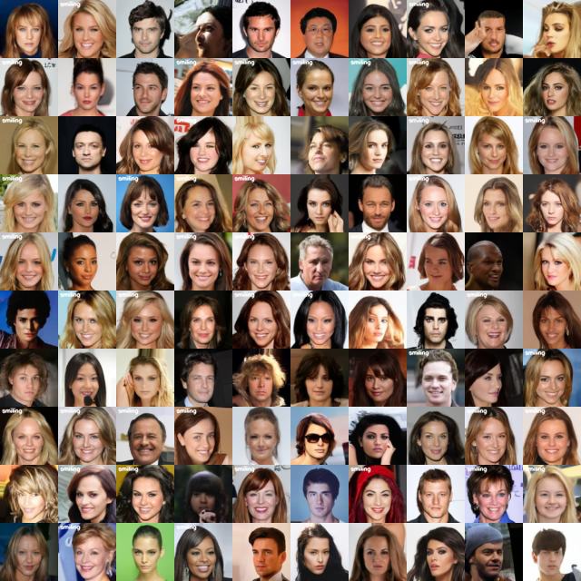
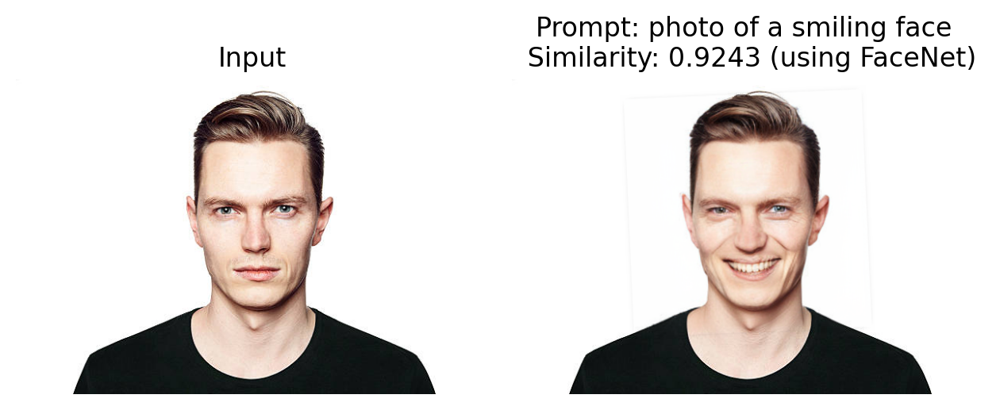
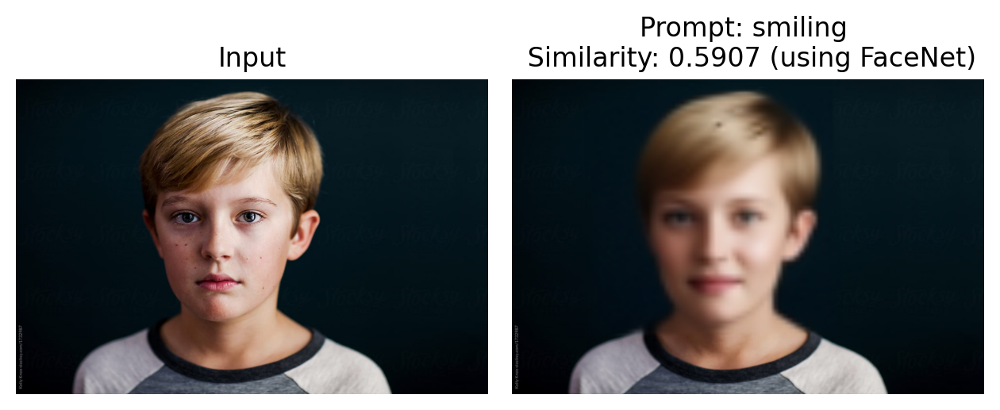

# Generative Modelling Toolkit

This repository provides a set of tools to quickly set up and experiment with generative modelling. It includes easy-to-use scripts and configuration files, enabling users to run experiments with various generative models with minimal setup.

## Features

- Modular codebase for generative models (Diffusion, VAE, etc.)
- Configurable experiments via YAML files in [`configs/`](configs/)
- Ready-to-use training and evaluation scripts
- Extensible support for datasets (see [`loaders/`](loaders/))
- Extensible loss and metric modules

## TODOs
- [x] Add support for diffusion network
- [x] Add support for flow matching
- [ ] Add support for GANs
- [x] Add support for CFG in diffusion/flow
- [x] Add support for CelebA dataset
- [x] Add DiT blocks
- [x] Add some results

## Getting Started

### 1. Clone the Repository

```sh
git clone https://github.com/ub216/GenerativeModelling
cd GenerativeModelling
```

### 2. Set Up the Environment

#### Using Conda

```sh
conda create -n genmod python=3.10 -y
conda activate genmod
pip install -r requirements.txt
```

#### Using pip

```sh
python3 -m venv venv
source venv/bin/activate
pip install -r requirements.txt
```

### 3. Configure Your Experiment

Edit or create a config file in [`configs/`](configs/) (e.g., [`configs/diffusion.yaml`](configs/diffusion.yaml), [`configs/vae.yaml`](configs/vae.yaml)) to specify model, dataset, and training parameters.

### 4. Train a Model

Run the training script with your chosen config:

```sh
python train.py --config configs/diffusion.yaml
```

### 5. Evaluate a Model

After training, evaluate your model using:

```sh
python eval.py --config configs/diffusion.yaml
```

### 6. Edit face image to add smile
This needs [`facenet-pytorch`](https://github.com/timesler/facenet-pytorch) to help detect and algn faces.
```sh
pip install --no-deps facenet-pytorch pillow
```

Then run:
```sh
python smile.py --input <path_to_serious_face_image>
```
(see the avilable parameters in smile.py to experiment with)

### 7. Results
#### Results for diffusion model trained on CelebA datasets (64x64).
You can donwload this model from [here](https://drive.google.com/file/d/1Pb9B6iuZvVoaCEp4_dETjzSAUHu9yRqP/view?usp=sharing)



#### Results for CFG based image editing (add smile)
**Positive example**


**Incorrect identity** preservation:


### Note: 
- We use invert then edit here. Could also be extended to SDEdit which adds randomness.
- Bluriness is because the model was trained on a lower resolution. 


## Repository Structure

- [`train.py`](train.py): Script to train generative models.
- [`eval.py`](eval.py): Script to evaluate trained models.
- [`configs/`](configs/): YAML configuration files for experiments.
- [`models/`](models/): Model architectures.
- [`losses/`](losses/): Loss functions for training.
- [`metrics/`](metrics/): Evaluation metrics.
- [`loaders/`](loaders/): Dataset loaders.
- [`helpers/`](helpers/): Factory functions and classes.
- [`edit_images/`](edit_images/): Use diffusion model + CFG to edit face images

## Contributing

Feel free to open issues or submit pull requests to improve the toolkit!

## License

MIT License
